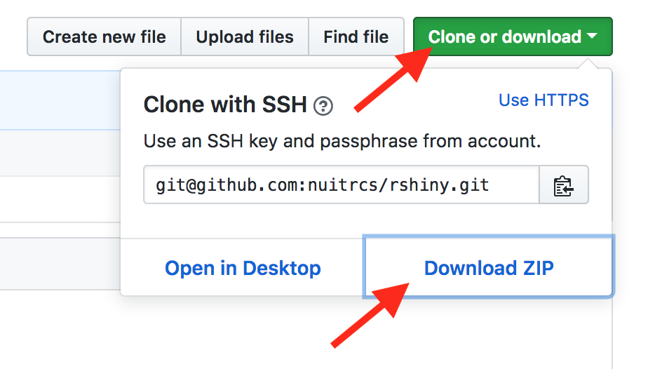

# intro to R workshop materials
This contains resources for RQDA lectures delivered on September, 2019, at JW LEE Center for Global Medicine. I would like to thank all the R community without which it won't be possible to compile these materials. 

This will Contains 
- R Code 
- Data for Practice 
- Presentation

# Software and Files

## R and RStudio Installation Instructions

This workshop assumes you have recent versions of R and RStudio. If you don't have R and RStudio Install from following links 

### For Windows 
R: https://cran.r-project.org/bin/windows/base/ 

R Studio: https://download1.rstudio.org/RStudio-1.1.463.exe

### For Mac
R: https://cran.r-project.org/bin/macosx/R-3.5.1.pkg

R Studio: https://download1.rstudio.org/RStudio-1.1.463.dmg

### For Linux (ubuntu)
R 
```ubuntu
# R with OpenBLAS
sudo apt-get install r-base
```
RStudio 

```ubuntu
# R with OpenBLAS
sudo apt-get install libopenblas-base r-base
```

## Workshop Materials

How to get the materials depends on how you plan to access R and RStudio for the workshop.

### On your laptop 

If you installed R and RStudio on your laptop, download all of the materials to your laptop.  Click on the green Clone or Download button above, then download the repository as a ZIP file.  



Find the downloaded .zip file on your computer, likely in your Downloads folder.  Unzip it - usually by double-clicking.  This will create a directory.  Move this somewhere on your computer where you'll be able to find it, like your Documents folder.  

You should open the file `r_intro_nov2018.Rproj` in this folder to open the materials as an RStudio project.  Double-click on it from your Finder/File Explorer, or from RStudio, File menu > Open Project..., then navigate to the location of the file.

### using RStudio Cloud

If you're using RStudio Cloud, go to https://rstudio.cloud and log in (or create an account if needed).  Click on Your Workspace in the left Menu.  Then make sure you are on the Projects tab, and click down arrow in the blue button for New Project.  Choose the option of New Project from a Git Repo.  The repo address is https://github.com/prabinrs/introR_Nov2018.  


This will copy all of the files from this repository into your new project.  This will take a few moments to copy files from this repository.  You'll then need to install packages.  Open `packagelist.r` and run the code.  The tidyverse package will take a while to install.  

You can use this space like you would your RStudio on own computer, except you can only access the files that are part of the project and save files within the project.

## Types of Files

**Slides:** The presentation fies are avaliable as Powerpoint. 
**Dataset:**Transcribes of interviews as text file. The datasets are from the research project that explored the science and practice of ecological monitoring for adaptive management. The team conducted a qualitative case study of a project intended to develop an adaptive management approach to vegetation restoration in the ‘Wildlands National Park,’ Australia (hereafter referred to as 'the Wildlands AM project'). ‘Wildlands’ is a pseudonym – all place and personal names associated with the AM project have been changed to protect the participants’ anonymity. The data is avaliable for under CC0 "Public Domain Dedication" via Havard dataverse. 

## Opening/Downloading Files

RMarkdown files can be previewed in GitHub, but they won't include the output of the code cells.  HTML files generated from the RMarkdown generally can't be previewed directly in the GitHub repository view, but they can be viewed online through GitHub Pages; links are provided for that where relevant.  HTML files are self-contained; this means they are on the large side, but they can be downloaded and viewed locally as a single file.

REMEMBER: if downloading individual files from GitHub, you want to download the RAW version of a file.  Otherwise, it's often better to download everything together by using the green clone/download button for the entire repository.

## Other Resources
